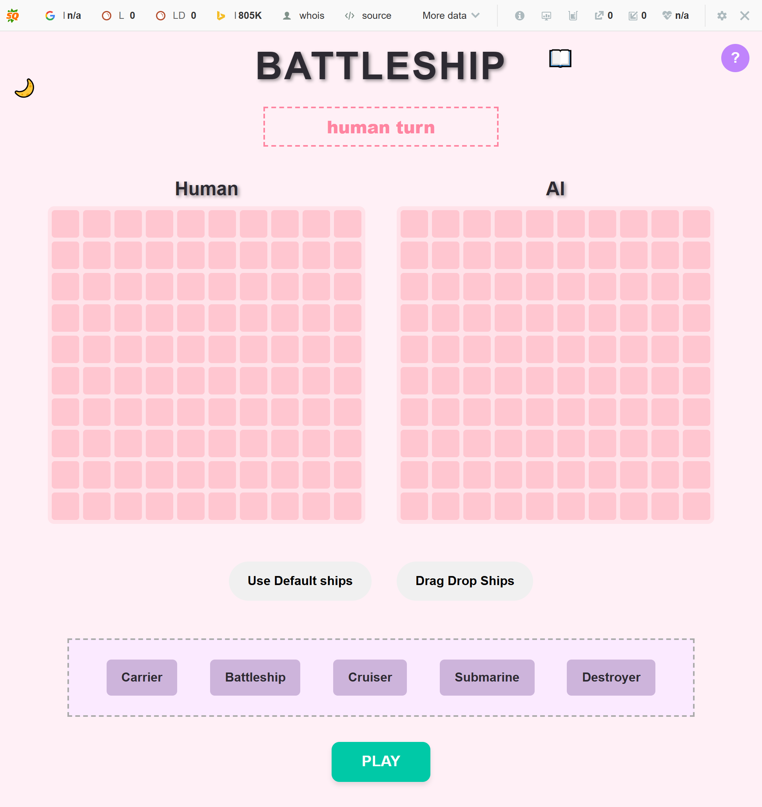

🚢 Battleship

A feature-rich, browser-based Battleship game built with modern JavaScript, bundled with Webpack, and fully tested using Jest. This project highlights my ability to design modular architecture, build interactive drag-and-drop UIs, and enhance user experience with dynamic themes, sound, and smart AI.

Project screen shots:

.png>)

.png>)
.png>)
.png>)
.png>)
🔗 Live Demo    👉 Play the Game Now

https://shila-mehta.github.io/Battleship/

🧩 Highlights

✅ Modular JavaScript Architecture

✅ AI Opponent with Easy & Smart Modes

✅ Drag-and-Drop Ship Placement

✅ Light/Dark Theme Toggle

✅ Sound Effects + Background Music

✅ Fully Unit-Tested with Jest

✅ Responsive UI & Game Over Overlay

🎮 Gameplay Features

🎯 AI Opponent
Easy Mode: Random valid attacks

Hard Mode: Implements "hunt and target" logic

Tracks previous hits and targets adjacent cells

Avoids repeating previous moves

🛠 Shipyard & Placement
Drag ships from the shipyard onto the game board

Rotate ships using the R key

Toggle between manual and default auto-placement

Visual feedback with collision and boundary detection

🖼 UI & Experience
Toggle between light and dark themes

A different color theme is applied on every reload

Sound effects for:

Hit/miss feedback on cell click

Background music on "Play"

Music stops and Game Over popup appears when game ends

Game Over popup with a blurred background and restart button

Live message bar shows current turn and game result

🎨 Visual Legend

🟥 Hit

⬜ Miss

⚪ Empty

🟪 Ship

🧪 Testing

Built using Test-Driven Development (TDD)

Unit tests written with Jest

Fully tested modules:

Ship

Gameboard

Player, HumanPlayer, AIPlayer

⚙️ Tech Stack

JavaScript (ES6 Modules)

Webpack

Babel

Jest

HTML5 + CSS3 (with CSS Variables and Modular Structure)

🚀 Getting Started

# Clone the repo

git clone https://github.com/Shila-Mehta/Battleship.git

cd battleship

# Install dependencies

npm install

# Start the development server

npm start

# Run tests

npm test


📁 Project Structure
```
└── 📁Battleship
    └── 📁src
        └── 📁assets
            └── 📁sounds
                ├── hit.wav
                ├── play.mp3
        └── 📁Classes
            ├── Game.js
            ├── Gameboard.js
            ├── ship.js
        └── 📁Components
            ├── createBoard.js
            ├── dragDropContaroller.js
            ├── handleAIAttack.js
            ├── handleHumanAttack.js
            ├── ThemeManager.js
        └── 📁Data
            ├── cellStates.js
            ├── ColorThemes.js
            ├── dragState.js
        └── 📁players
            ├── AIPlayer.js
            ├── HumanPlayer.js
            ├── Player.js
        └── 📁Services
            ├── GameServices.js
            ├── SoundService.js
        └── 📁Styles
            ├── base.css
            ├── board.css
            ├── buttons.css
            ├── guide.css
            ├── layout.css
            ├── legend.css
            ├── main.css
            ├── popup.css
            ├── shipyard.css
            ├── variables.css
        ├── index.js
        ├── template.html
    └── 📁tests
        ├── AIPlayer.test.js
        ├── Game.test.js
        ├── GameBoard.test.js
        ├── HumanPlayer.test.js
        ├── Player.test.js
        ├── ship.test.js
    ├── .gitignore
    ├── babel.config.json
    ├── package-lock.json
    ├── package.json
    ├── README.md
    └── webpack.config.js
```
🔥 Why This Project?

This game isn’t just about fun — it demonstrates:

DOM manipulation without frameworks

Scalable and testable JavaScript module design

Intelligent AI behavior using algorithmic decision-making

Clean state management in a turn-based system

Thoughtful UI/UX features: animations, sounds, visual feedback

Test-Driven Development practices with complete unit testing

👩‍💻 About Me

I'm a front-end developer passionate about building polished, interactive web applications with a focus on user experience, performance, and clean architecture.

📁 View more of my work on my portfolio(https://nimra-react-portfolio.netlify.app/)

💼 Connect with me on LinkedIn (https://www.linkedin.com/in/n-jabbar-1113aa374/)

📄 License

This project is licensed under the MIT License.

